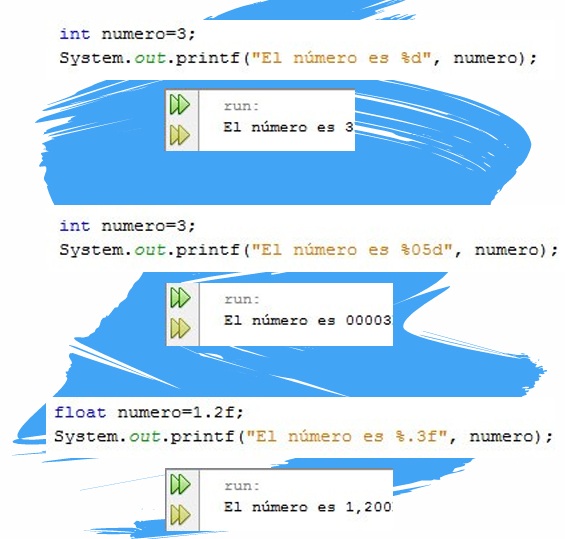

# UD1 - Introducción a la Programación en Java

> **IES 1 Torrevigía** · Programación 1º DAW · Francisco J. Guirau López

---

## 1.1 Nuestro primer programa en Java

Empezamos viendo un sencillo programa que muestra un texto por pantalla, analizando cada una de las líneas de código.


```java
public class Bienvenido {

    //El método main empieza la ejecución de la Aplicación Java
    public static void main(String[] args) {
        System.out.println("Bienvenid@ a la programación Java");
    
    } //Fin del método main

}   //Fin de la clase Bienvenido
```
El programa muestra por pantalla el mensaje:

```
Bienvenid@ a la programación Java
```

---

## 1.2. Declaración de clase (`class`)

Todo programa en Java contiene **al menos una clase** que nosotros debemos definir. La palabra clave `class` es la encargada de definirla.

```java
//Definimos la clase Bienvenido
public class Bienvenido {

}
```

!!! info "Convención de nombres"
    Por convención, los nombres de clases comienzan con **letra mayúscula**, y la primera letra de cada palabra también va en mayúscula.  
    Ejemplo: `EjemploNombreDeClase`

Un **identificador** de clase puede contener:

- Letras y dígitos
- Guiones bajos (`_`) y signos de moneda (`$`)
- **No** puede comenzar con un dígito ni contener espacios

!!! warning "Nombre del archivo"
    El archivo que contiene la clase **debe tener el mismo nombre** que la clase con extensión `.java`.  
    En nuestro ejemplo: `Bienvenido.java`

---

## 1.3. El método `main` — Punto de inicio

```java
public static void main(String[] args)
```

Esta línea es el **punto de inicio de toda aplicación Java**.

| Elemento | Significado |
|---|---|
| `public` | Accesible desde cualquier lugar |
| `static` | Pertenece a la clase, no a un objeto |
| `void` | No devuelve ningún valor |
| `main` | Nombre del método de inicio |
| `String[] args` | Argumentos que se pueden pasar al programa |

---

## 1.4. Mostrar información por pantalla

### 1.4.1 `System.out.println`

`System.out` es el **objeto de salida estándar**. Permite mostrar información en la ventana de comandos.

```java
System.out.println("Bienvenid@ a la programación Java");
```

`println` muestra el texto y deja el cursor en una **nueva línea**. La cadena dentro de los paréntesis es el argumento para el método, “Bienvenid@ a la programación Java”

---

### 1.4.2 Métodos de salida: `print`, `println` y `printf`

Las siguientes líneas son **equivalentes** (todas muestran el mismo mensaje y dejan el cursor en una línea nueva):

```java
System.out.println("Bienvenid@ a la programación Java");
System.out.print("Bienvenid@ a ");
System.out.print("la programación Java\n");
System.out.printf("Bienvenid@ a la programación Java\n");
```

| Método | Comportamiento |
|---|---|
| `println` | Muestra el texto y salta a nueva línea automáticamente |
| `print` | Muestra el texto en la misma línea (usa `\n` para saltar) |
| `printf` | Formato avanzado (similar al `printf` de C) |

---

### 1.4.3 Concatenar valores con `+`

Se pueden unir texto y variables con el operador `+`:
Aunque se verán las variables y los operadores en profundidad en la siguiente unidad, podemos observar en este caso como se utiliza el operador **+** para concatenar el texto con el valor de la variable

```java
int resultado = 4;
System.out.println("El resultado es " + resultado);
```

**Salida:**
```
El resultado es 4
```

---

### 1.4.4 Formato con `printf`

`System.out.printf` permite especificar el tipo de dato con **especificadores de formato**:

| Especificador | Tipo de dato |
|---|---|
| `%d` | Entero (`int`, `long`) |
| `%f` | Real (`float`, `double`) |
| `%c` | Carácter (`char`) |
| `%s` | Cadena de texto (`String`) |

```java
int edad = 20;
double nota = 8.5;
char letra = 'A';

System.out.printf("Edad: %d, Nota: %.1f, Letra: %c%n", edad, nota, letra);
```

**Salida:**
```
Edad: 20, Nota: 8.5, Letra: A
```
**Ejemplo:**
{ .center }
---

## 1.5. Entrada de datos desde consola (`Scanner`)

Para leer datos introducidos por el usuario desde teclado usamos la clase **`Scanner`**.

### 1.5.1 Importar y crear el Scanner

```java
import java.util.Scanner;  // (1)

Scanner sc = new Scanner(System.in);  // (2)
```

1. Importamos la clase `Scanner` del paquete `java.util`
2. Creamos un objeto `Scanner` vinculado a la entrada estándar (`System.in`)

---

### 1.5.2 Métodos de lectura

| Método | Lee... |
|---|---|
| `nextInt()` | Un número entero |
| `nextDouble()` | Un número real |
| `nextLine()` | Una línea completa de texto |
| `next().charAt(0)` | Un solo carácter |

!!! warning "Limpiar el buffer"
    Después de leer un número con `nextInt()`, es necesario llamar a `sc.nextLine()` para limpiar el salto de línea que queda en el buffer, y evitar que la siguiente lectura sea ignorada.

---

### 1.5.3 Ejemplo completo de entrada de datos

```java
import java.util.Scanner;

public class EntradaDatos {
    public static void main(String[] args) {
        Scanner sc = new Scanner(System.in);

        System.out.print("Introduce tu nombre: ");
        String nombre = sc.nextLine();

        System.out.print("Introduce tu edad: ");
        int edad = sc.nextInt();
        sc.nextLine(); // limpiamos el buffer

        System.out.print("Introduce una letra: ");
        char letra = sc.next().charAt(0);

        System.out.printf("Hola %s, tienes %d años y tu letra es %c%n", nombre, edad, letra);
    }
}
```

**Salida (ejemplo):**
```
Introduce tu nombre: Ana
Introduce tu edad: 21
Introduce una letra: J
Hola Ana, tienes 21 años y tu letra es J
```

---

## Resumen de la unidad

```
class NombreClase {
    public static void main(String[] args) {
        // Aquí va el código
    }
}
```

Los conceptos clave de esta unidad son:

- Todo programa Java parte de una **clase** con un método **`main`**
- Usamos `System.out.println` / `print` / `printf` para **mostrar** datos
- Usamos `Scanner` para **leer** datos del usuario
- El archivo debe llamarse igual que la clase pública (ej: `Bienvenido.java`)
