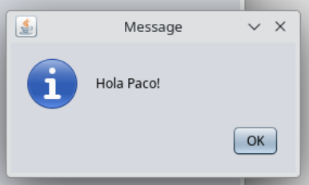
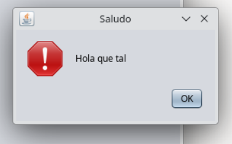
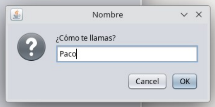
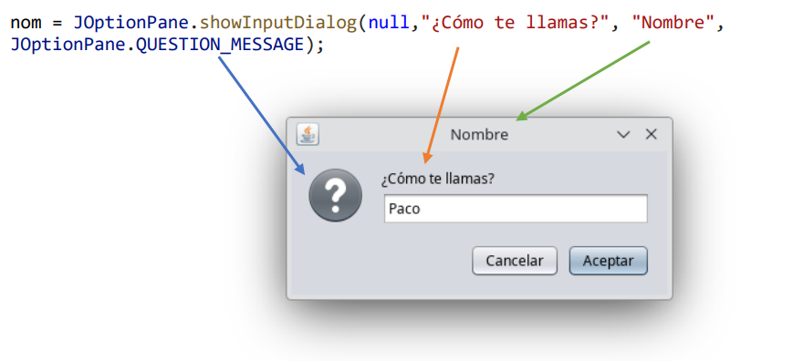
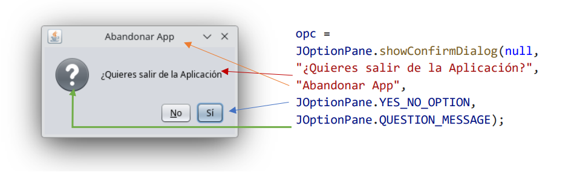
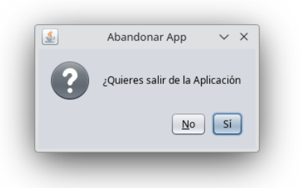

# UD11 - Interfaces Gráficas con Swing

> Creación de interfaces gráficas en Java usando NetBeans y la librería Swing.

---

## 11.1. Mensajes emergentes — `JOptionPane`

`JOptionPane` es un objeto Java que permite mostrar tres tipos de cuadros de diálogo de forma rápida, sin necesidad de diseñar una ventana manualmente.

```java
import javax.swing.JOptionPane;
```

---

### 11.1.1 Cuadros de mensaje — `showMessageDialog`

Muestran un mensaje al usuario con un icono informativo.

```java
// Sintaxis completa
JOptionPane.showMessageDialog(null, "Mensaje", "Título", JOptionPane.TIPO_ICONO);

// Sintaxis reducida (sin título ni icono)
JOptionPane.showMessageDialog(null, "Mensaje");
```

{ .center }

**Parámetros:**

| Parámetro | Descripción |
|---|---|
| `null` | Siempre `null` (ventana padre) |
| `"Mensaje"` | Texto que se mostrará |
| `"Título"` | Título de la ventana del diálogo |
| Tipo icono | Icono que aparece en el diálogo |

**Tipos de icono disponibles:**

| Constante | Icono |
|---|---|
| `JOptionPane.ERROR_MESSAGE` | ❌ Error |
| `JOptionPane.INFORMATION_MESSAGE` | ℹ️ Información |
| `JOptionPane.QUESTION_MESSAGE` | ❓ Pregunta |
| `JOptionPane.WARNING_MESSAGE` | ⚠️ Advertencia |
| `JOptionPane.PLAIN_MESSAGE` | Sin icono |

```java
// Ejemplo
JOptionPane.showMessageDialog(null, "Hola que tal", "Saludo", JOptionPane.WARNING_MESSAGE);
```

{ .center }

---

### 11.1.2 Cuadros de entrada — `showInputDialog`

Permiten al usuario escribir un dato. El valor introducido se devuelve como `String`.

```java
String variable = JOptionPane.showInputDialog(null, "Petición", "Título", JOptionPane.TIPO_ICONO);
```

{ .center }

!!! info "El resultado se almacena en una variable"
    A diferencia de `showMessageDialog`, aquí la instrucción se iguala a una variable `String` que recogerá el texto escrito por el usuario.

```java
String nom = "";
nom = JOptionPane.showInputDialog(null, "¿Cómo te llamas?", "Nombre", JOptionPane.QUESTION_MESSAGE);
JOptionPane.showMessageDialog(null, "Hola " + nom + "!");
```

{ .center }

---

### 11.1.3 Cuadros de confirmación — `showConfirmDialog`

Muestran una pregunta con botones de respuesta. Devuelven un `int` con la opción elegida.

```java
int opc = JOptionPane.showConfirmDialog(null, "Pregunta", "Título", TIPO_BOTONES, TIPO_ICONO);
```

{ .center }

**Tipos de botones:**

| Constante | Botones |
|---|---|
| `JOptionPane.YES_NO_OPTION` | Sí / No |
| `JOptionPane.OK_CANCEL_OPTION` | Aceptar / Cancelar |
| `JOptionPane.YES_NO_CANCEL_OPTION` | Sí / No / Cancelar |

**Comprobar la respuesta:**

| Constante | Botón pulsado |
|---|---|
| `JOptionPane.YES_OPTION` | Sí |
| `JOptionPane.NO_OPTION` | No |
| `JOptionPane.OK_OPTION` | Aceptar |
| `JOptionPane.CANCEL_OPTION` | Cancelar |

```java
int opc;
opc = JOptionPane.showConfirmDialog(
    null,
    "¿Quieres salir de la aplicación?",
    "Abandonar App",
    JOptionPane.YES_NO_OPTION,
    JOptionPane.QUESTION_MESSAGE
);

if (opc == JOptionPane.YES_OPTION)
    JOptionPane.showMessageDialog(null, "¡Has pulsado Sí!");
else
    JOptionPane.showMessageDialog(null, "¡Has pulsado No!");
```

{ .center }

---

### Resumen de `JOptionPane`

| Método | Uso | Devuelve |
|---|---|---|
| `showMessageDialog` | Mostrar un mensaje | `void` |
| `showInputDialog` | Pedir un dato al usuario | `String` |
| `showConfirmDialog` | Preguntar Sí/No/Aceptar | `int` |
