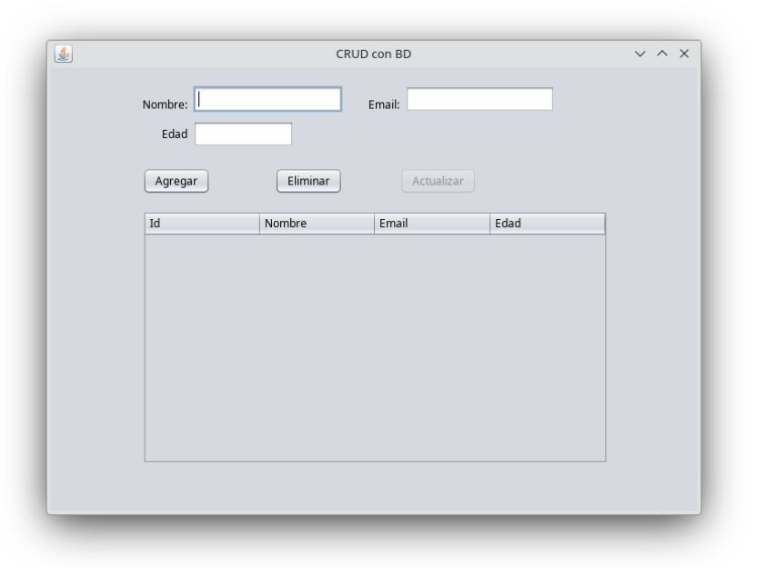

# UD12 - Operaciones CRUD en Bases de Datos

> Aplicación Java con interfaz gráfica Swing que realiza operaciones CRUD sobre una BD MySQL usando JDBC.

---

## 12.1. ¿Qué es CRUD?

CRUD es el acrónimo de las cuatro operaciones básicas sobre datos:

| Letra | Significado | SQL | Acción |
|---|---|---|---|
| **C** | Create | `INSERT` | Crear / Insertar registros |
| **R** | Read | `SELECT` | Leer / Consultar registros |
| **U** | Update | `UPDATE` | Actualizar registros |
| **D** | Delete | `DELETE` | Eliminar registros |

Estas cuatro acciones forman la base de casi cualquier aplicación que trabaje con datos: gestión de alumnos, tiendas online, sistemas de clientes, etc.

---

## 12.2. Estructura del proyecto

Vamos a crear una aplicación **CRUDJava** en NetBeans que combina:

- **JDBC** — conexión con la base de datos
- **MySQL** — almacenamiento de los datos
- **Swing (JFrame + JTable)** — interfaz gráfica

### 12.2.1 Tabla en MySQL

```sql
CREATE TABLE usuarios (
    id    INT AUTO_INCREMENT PRIMARY KEY,
    nombre VARCHAR(100),
    email  VARCHAR(100),
    edad   INT
);
```

### 12.2.2 Clase `Conexion`

Crea una clase `Conexion.java` con un método estático que gestiona la conexión:

```java
import java.sql.*;

public class Conexion {
    private static final String URL  = "jdbc:mysql://localhost/daw1_practicas";
    private static final String USER = "alumno";
    private static final String PASS = "alumno";

    public static Connection conectar() {
        try {
            return DriverManager.getConnection(URL, USER, PASS);
        } catch (Exception e) {
            System.out.println("Error conexión: " + e.getMessage());
            return null;
        }
    }
}
```

### 12.2.3 Diseño del formulario (`CRUDJava.java`)

{ .center }

Componentes necesarios:

| Componente | Nombre |
|---|---|
| Campo de texto | `txtNombre`, `txtEmail`, `txtEdad` |
| Botones | `btnAgregar`, `btnActualizar`, `btnEliminar` |
| Tabla | `jTable1` con columnas: ID, Nombre, Email, Edad |

!!! info "Configura el modelo de la tabla"
    En el constructor, después de `initComponents()`, inicializa el modelo de la tabla y carga los datos:
    ```java
    jTable1.setModel(new DefaultTableModel(
        new String[]{"ID", "Nombre", "Email", "Edad"}, 0
    ));
    btnActualizar.setEnabled(false);  // desactivado hasta seleccionar fila
    cargarTabla();
    ```

---

## 12.3. C — Create (Insertar usuario)

Al pulsar **Agregar**, se leen los campos de texto y se inserta un nuevo registro en la BD:

```java
private void btnAgregarActionPerformed(ActionEvent evt) {
    String sql = "INSERT INTO usuarios (nombre, email, edad) VALUES (?, ?, ?)";

    try {
        Connection con = Conexion.conectar();
        PreparedStatement ps = con.prepareStatement(sql);
        ps.setString(1, txtNombre.getText());
        ps.setString(2, txtEmail.getText());
        ps.setInt(3, Integer.parseInt(txtEdad.getText()));
        ps.executeUpdate();

        JOptionPane.showMessageDialog(null, "Usuario añadido correctamente");
        cargarTabla();
        con.close();

    } catch (Exception e) {
        JOptionPane.showMessageDialog(null, "Error al insertar: " + e.getMessage());
    }
}
```

---

## 12.4. R — Read (Mostrar usuarios)

La función `cargarTabla()` vacía la tabla y la rellena con todos los registros de la BD. Se llama al iniciar la app y después de cada operación:

```java
private void cargarTabla() throws SQLException {
    DefaultTableModel modelo = (DefaultTableModel) jTable1.getModel();
    modelo.setRowCount(0);  // vaciar filas anteriores

    Connection con = Conexion.conectar();

    try {
        Statement st = con.createStatement();
        ResultSet rs = st.executeQuery("SELECT * FROM usuarios");

        while (rs.next()) {
            modelo.addRow(new Object[]{
                rs.getInt("id"),
                rs.getString("nombre"),
                rs.getString("email"),
                rs.getInt("edad")
            });
        }

    } catch (SQLException e) {
        JOptionPane.showMessageDialog(this, "Error al cargar datos: " + e.getMessage());
    } finally {
        if (con != null) con.close();
    }
}
```

!!! tip "Usa `finally` para cerrar la conexión"
    Colocar `con.close()` en el bloque `finally` garantiza que la conexión se cierra aunque ocurra un error durante la consulta.

---

## 12.5. D — Delete (Eliminar usuario)

Al pulsar **Eliminar**:

1. Comprueba que hay una fila seleccionada
2. Pide confirmación con `showConfirmDialog`
3. Obtiene el `id` de la fila seleccionada y ejecuta el `DELETE`

```java
private void btnEliminarActionPerformed(ActionEvent evt) {
    int fila = jTable1.getSelectedRow();

    if (fila == -1) {
        JOptionPane.showMessageDialog(null, "Selecciona una fila primero");
        return;
    }

    DefaultTableModel modelo = (DefaultTableModel) jTable1.getModel();
    int id = (int) modelo.getValueAt(fila, 0);  // columna 0 = id

    int resp = JOptionPane.showConfirmDialog(
        this,
        "¿Eliminar el usuario con ID: " + id + "?",
        "Confirmar",
        JOptionPane.YES_NO_OPTION
    );

    if (resp != JOptionPane.YES_OPTION) return;

    String sql = "DELETE FROM usuarios WHERE id = ?";

    try {
        Connection con = Conexion.conectar();
        PreparedStatement ps = con.prepareStatement(sql);
        ps.setInt(1, id);
        ps.executeUpdate();

        JOptionPane.showMessageDialog(null, "Usuario eliminado correctamente");
        cargarTabla();
        con.close();

    } catch (Exception e) {
        JOptionPane.showMessageDialog(null, "Error al eliminar: " + e.getMessage());
    }
}
```

---

## 12.6. U — Update (Actualizar usuario)

### 12.6.1 Cargar datos al hacer clic en una fila

Al hacer clic sobre la tabla, los datos de la fila seleccionada se cargan en los campos de texto y se activa el botón **Actualizar**:

```java
private void jTable1MouseClicked(MouseEvent evt) {
    int fila = jTable1.getSelectedRow();

    if (fila == -1) {
        JOptionPane.showInternalMessageDialog(null, "Selecciona una fila primero",
            "Error", JOptionPane.ERROR_MESSAGE);
        return;
    }

    DefaultTableModel modelo = (DefaultTableModel) jTable1.getModel();
    txtNombre.setText(modelo.getValueAt(fila, 1).toString());
    txtEmail.setText(modelo.getValueAt(fila, 2).toString());
    txtEdad.setText(modelo.getValueAt(fila, 3).toString());

    btnActualizar.setEnabled(true);  // activar botón
}
```

### 12.6.2 Ejecutar el UPDATE

```java
private void btnActualizarActionPerformed(ActionEvent evt) {
    int fila = jTable1.getSelectedRow();

    if (fila == -1) {
        JOptionPane.showMessageDialog(null, "Selecciona una fila primero");
        return;
    }

    DefaultTableModel modelo = (DefaultTableModel) jTable1.getModel();
    int id = (int) modelo.getValueAt(fila, 0);

    String sql = "UPDATE usuarios SET nombre=?, email=?, edad=? WHERE id=?";

    try {
        Connection con = Conexion.conectar();
        PreparedStatement ps = con.prepareStatement(sql);
        ps.setString(1, txtNombre.getText());
        ps.setString(2, txtEmail.getText());
        ps.setInt(3, Integer.parseInt(txtEdad.getText()));
        ps.setInt(4, id);
        ps.executeUpdate();

        JOptionPane.showMessageDialog(null, "Usuario actualizado correctamente");
        cargarTabla();
        btnActualizar.setEnabled(false);  // desactivar hasta nueva selección
        con.close();

    } catch (Exception e) {
        JOptionPane.showMessageDialog(null, "Error al actualizar: " + e.getMessage());
    }
}
```

---

## 12.7. Flujo completo de la aplicación

```
Inicio
  └── cargarTabla() → muestra todos los registros en jTable1

Agregar
  └── leer txtNombre, txtEmail, txtEdad
  └── INSERT INTO usuarios → cargarTabla()

Clic en fila
  └── cargar datos en txtFields
  └── activar btnActualizar

Actualizar
  └── leer id de la fila seleccionada + nuevos datos de txtFields
  └── UPDATE usuarios WHERE id = ? → cargarTabla()
  └── desactivar btnActualizar

Eliminar
  └── leer id de la fila seleccionada
  └── showConfirmDialog → si YES: DELETE WHERE id = ? → cargarTabla()
```

---

## Resumen de la unidad

| Operación | SQL | Método JDBC |
|---|---|---|
| Insertar | `INSERT INTO ...` | `ps.executeUpdate()` |
| Consultar | `SELECT * FROM ...` | `st.executeQuery()` → `ResultSet` |
| Actualizar | `UPDATE ... SET ... WHERE id=?` | `ps.executeUpdate()` |
| Eliminar | `DELETE FROM ... WHERE id=?` | `ps.executeUpdate()` |
| Refrescar tabla | — | `modelo.setRowCount(0)` + bucle `addRow` |
| Obtener fila seleccionada | — | `jTable1.getSelectedRow()` |
| Leer celda de la tabla | — | `modelo.getValueAt(fila, columna)` |
