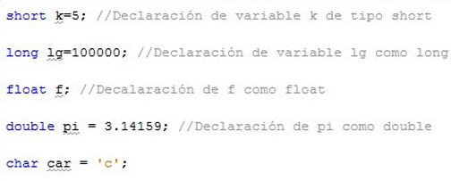
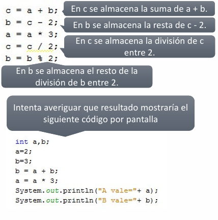

# UD2 - Sintaxis Básica en Java

> Tipos de datos primitivos, constantes, operadores, operaciones abreviadas y comentarios.

---

## 2.1. Tipos de datos primitivos

Java define **ocho tipos de datos primitivos** agrupados en cuatro categorías:

| Categoría | Tipos | Descripción |
|---|---|---|
| **Enteros** | `byte`, `short`, `int`, `long` | Números enteros positivos y negativos |
| **Punto decimal** | `float`, `double` | Números con precisión fraccional |
| **Caracteres** | `char` | Símbolos de un conjunto de caracteres (letras, números...) |
| **Booleanos** | `boolean` | Valores lógicos: `true` o `false` |

---

## 2.2. Variables

### 2.2.1 Declaración

La sintaxis para declarar una variable es:

```java
tipo nombreVariable [= valor];
```

- **`tipo`** — uno de los tipos primitivos de Java: `int`, `double`, `char`...
- **`nombreVariable`** — el nombre que le damos a la variable
- **`= valor`** — opcional; si se indica, es el valor inicial de la variable

### 2.2.2 Ejemplos de declaración

```java
int edad = 19;          // Variable entera con valor inicial
int altura;             // Variable entera sin valor inicial
int var1, var2, var3;   // Múltiples variables del mismo tipo en una línea
```

!!! info "Ámbito de una variable"
    Las variables declaradas dentro de unas llaves `{}` (un bloque) solo son visibles y existen dentro de ese bloque. Se suelen declarar al principio del método donde se van a utilizar.
**Ejemplo:**
{ .center }
---

## 2.3. Constantes

Las constantes son variables cuyo **valor no cambia nunca** durante la ejecución del programa.

```java
static final tipo NOMBRE_CONSTANTE = valor;
```

- **`final`** — impide que el valor cambie (equivalente a `const` en C/C++)
- **`static`** — la constante pertenece a la clase, no a cada objeto
- Por convención, los nombres de constantes se escriben en **MAYÚSCULAS**

### 2.3.1 Ejemplos

```java
static final double PI = 3.14159;
static final int DIAS_SEMANA = 7;
```

---

## 2.4. Secuencias de escape

Algunos caracteres no se pueden escribir directamente en una cadena. Java proporciona **secuencias de escape** combinando `\` con un carácter:

| Secuencia | Descripción |
|---|---|
| `\t` | Inserta un tabulador |
| `\b` | Retroceder un espacio (backspace) |
| `\n` | Inserta una nueva línea |
| `\r` | Inserta un retorno de carro |
| `\f` | Inserta un salto de página |
| `\'` | Inserta una comilla simple |
| `\"` | Inserta una comilla doble |
| `\\` | Inserta una barra invertida |

### 2.4.1 Ejemplo

```java
System.out.println("Primera línea\nSegunda línea");
System.out.println("Nombre:\tAna");
System.out.println("Dice: \"Hola\"");
```

**Salida:**
```
Primera línea
Segunda línea
Nombre:	    Ana
Dice: "Hola"
```

---

## 2.5. Operadores aritméticos
En Java podemos realizar operaciones matemáticas, para ello el lenguaje nos proporciona los siguientes operadores: **`+`** (suma), **`-`** (resta), **`*`** (multiplicación), **`/`** (división) y **`%`** (resto de la división). 

| Operador | Operación | Ejemplo |
|---|---|---|
| `+` | Suma | `var1 + var2` |
| `-` | Resta | `var1 - var2` |
| `*` | Multiplicación | `var1 * var2` |
| `/` | División | `var1 / var2` |
| `%` | Resto de la división | `var1 % var2` |

### 2.5.1 Ejemplo

```java
int a = 10, b = 3;

System.out.println(a + b);   // 13
System.out.println(a - b);   // 7
System.out.println(a * b);   // 30
System.out.println(a / b);   // 3  (división entera)
System.out.println(a % b);   // 1  (resto)
```
**Ejemplo:**
{ .center }
---

## 2.6. Operadores de incremento y decremento

Permiten aumentar o reducir en **una unidad** el valor de una variable:

| Operador | Nombre | Efecto |
|---|---|---|
| `var++` | Postincremento | Usa el valor y **luego** incrementa |
| `++var` | Preincremento | **Primero** incrementa y luego usa el valor |
| `var--` | Postdecremento | Usa el valor y **luego** decrementa |
| `--var` | Predecremento | **Primero** decrementa y luego usa el valor |

### 2.6.1 Diferencia entre pre y post

```java
int b = 3;
int a = b++;   // a = 3, b = 4  → primero asigna, luego incrementa
```

```java
int b = 3;
int a = ++b;   // a = 4, b = 4  → primero incrementa, luego asigna
```

```java
int b = 3;
int a = b--;   // a = 3, b = 2  → primero asigna, luego decrementa
```

```java
int b = 3;
int a = --b;   // a = 2, b = 2  → primero decrementa, luego asigna
```

!!! warning "Cuidado con pre/post en asignaciones"
    `var++` y `++var` tienen el mismo efecto cuando se usan solos en una línea. La diferencia aparece cuando forman parte de una expresión como `a = b++`.

---

## 2.7. Operaciones abreviadas

Cuando una variable aparece a ambos lados de una operación, se puede usar **notación abreviada**:

```java
// Estas dos líneas son equivalentes:
a = a * 3;
a *= 3;
```

Sintaxis general:

```java
var1 op= var2;   // equivale a: var1 = var1 op var2;
```

| Abreviada | Equivale a |
|---|---|
| `a += b` | `a = a + b` |
| `a -= b` | `a = a - b` |
| `a *= b` | `a = a * b` |
| `a /= b` | `a = a / b` |
| `a %= b` | `a = a % b` |

### 2.7.1 Ejemplo

```java
int a = 10;
a += 5;    // a = 15
a -= 3;    // a = 12
a *= 2;    // a = 24
a /= 4;    // a = 6
a %= 4;    // a = 2
```

---

## 2.8. Comentarios

Los comentarios son bloques de texto que el compilador **ignora**. Se usan para documentar el código.

### Comentario de una línea

```java
// Esto es un comentario de una línea
int edad = 20;  // También puede ir al final de una línea de código
```

### Comentario multilínea

```java
/*
  Esto es un comentario
  que ocupa varias líneas.
  El compilador ignora todo lo que hay entre /* y */
*/
int altura = 175;
```

!!! tip "Buena práctica"
    Comenta el **por qué** de tu código, no el **qué**. El código ya dice qué hace; los comentarios deben explicar la razón o el contexto.

---

## Resumen de la unidad

| Concepto | Ejemplo |
|---|---|
| Variable entera | `int edad = 20;` |
| Constante | `static final double PI = 3.14159;` |
| Salto de línea | `"\n"` |
| Resto de división | `10 % 3` → `1` |
| Postincremento | `a = b++` → asigna primero |
| Preincremento | `a = ++b` → incrementa primero |
| Op. abreviada | `a *= 2` → `a = a * 2` |
| Comentario línea | `// texto` |
| Comentario bloque | `/* texto */` |
