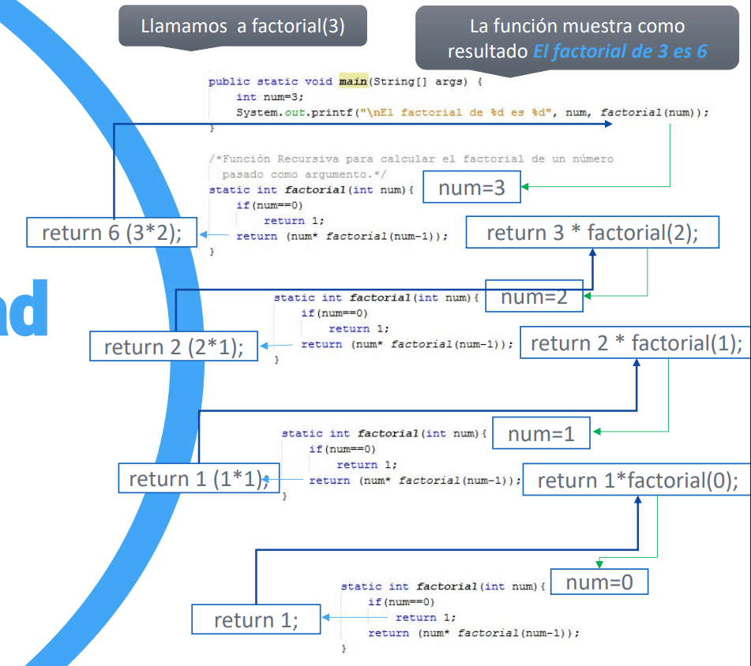

# UD5 - Funciones y Recursividad

---

## 5.1. Funciones

La mejor forma de mantener un programa extenso es construirlo a partir de **pequeñas piezas independientes** llamadas **funciones** o **métodos**. Permiten dividir el programa en unidades autónomas, reutilizables y más fáciles de mantener.

### 5.1.1 Declaración

```java
tipoDev nombreFuncion(listaParametros) {
    // cuerpo de la función
    return valor; // si tipoDev no es void
}
```

- **`tipoDev`** — tipo de dato que devuelve la función (`int`, `double`, `void`...)
- **`nombreFuncion`** — nombre de la función
- **`listaParametros`** — parámetros que recibe (puede estar vacía)

### 5.1.2 Ejemplos

```java
// Función que no recibe parámetros y devuelve un entero
static int metodoEntero() {
    return 42;
}

// Función que recibe parámetros y no devuelve nada (void)
static void procedimiento(int num, String texto) {
    System.out.println(texto + ": " + num);
}

// Función que recibe dos enteros y devuelve su suma
static int sumar(int a, int b) {
    return a + b;
}

// Función void que realiza y muestra la multiplicación
static void multiplicar(int a, int b) {
    System.out.println(a + " x " + b + " = " + (a * b));
}
```

```java
public static void main(String[] args) {
    int resultado = sumar(5, 3);   // llamada a la función
    System.out.println(resultado); // 8

    multiplicar(4, 7);             // 4 x 7 = 28
}
```

!!! info "Funciones dentro de `main`"
    Cuando una función se llama desde `main`, debe declararse como `static`. Más adelante, con la Programación Orientada a Objetos, veremos cuándo no es necesario.

---

## 5.2. Ámbito de las variables

Las variables declaradas **dentro de una función** son **locales** a ella: solo existen mientras la función se ejecuta y no son accesibles desde fuera.

```java
static void sumar(int a, int b) {
    int num = 2;  // variable local a sumar()
    System.out.println(a + b + num);
}

public static void main(String[] args) {
    int num = 10; // variable local a main()
    sumar(3, 4);
    System.out.println(num); // 10 → no se ve afectada por la num de sumar()
}
```

---

## 5.3. Paso de parámetros por valor

En Java, los tipos primitivos se pasan **por valor**: la función recibe una **copia** del dato. Cualquier modificación dentro de la función **no afecta** a la variable original.

```java
static void modificar(int x) {
    x = 999;  // solo modifica la copia local
}

public static void main(String[] args) {
    int num = 10;
    System.out.println(num);  // 10
    modificar(num);
    System.out.println(num);  // 10 → no ha cambiado
}
```

**Salida:**
```
10
10
```

!!! warning "Arrays y objetos NO se pasan por valor"
    Los arrays y objetos se pasan por referencia: si los modificas dentro de la función, los cambios sí se reflejan fuera. Esto lo verás con más detalle en la unidad de POO.

---

## 5.4. Sobrecarga de funciones

En Java se pueden declarar **varias funciones con el mismo nombre** en la misma clase, siempre que tengan **diferente lista de parámetros** (distinto número, tipo u orden).

```java
static int cuadrado(int num) {
    return num * num;
}

static double cuadrado(double num) {
    return num * num;
}
```

```java
public static void main(String[] args) {
    System.out.println(cuadrado(4));     // llama a la versión int  → 16
    System.out.println(cuadrado(3.5));   // llama a la versión double → 12.25
}
```

Java elige automáticamente qué versión ejecutar según el tipo del argumento que se le pasa.

---

## 5.5. Manejo de excepciones

Una **excepción** es un error que ocurre durante la ejecución del programa (por ejemplo, dividir entre cero). Java permite capturarlas con la estructura **`try-catch-finally`** para que el programa no se detenga inesperadamente.

```java
try {
    // código que puede lanzar una excepción
} catch (TipoExcepcion e) {
    // código que se ejecuta si ocurre la excepción
} finally {
    // código que se ejecuta SIEMPRE (con o sin excepción)
}
```

!!! info "Bloques opcionales"
    Se puede omitir `catch` o `finally`, pero no ambos a la vez.

### 5.5.1 Ejemplo: división por cero

```java
int a = 10, b = 0, resultado = 0;

try {
    resultado = a / b;                          // lanza ArithmeticException
} catch (ArithmeticException e) {
    System.out.println("Error: " + e.getMessage()); // / by zero
} finally {
    System.out.println("Resultado: " + resultado);  // 0
}
```

### 5.5.2 Múltiples `catch`

Se pueden capturar distintos tipos de excepción en el mismo bloque `try`:

```java
try {
    resultado = a / b;
} catch (ArithmeticException e) {
    System.out.println("Error aritmético: " + e.getMessage());
} catch (NullPointerException e) {
    System.out.println("Error: referencia nula");
} finally {
    System.out.println("Resultado: " + resultado);
}
```

---

## 5.6. Recursividad

Una **función recursiva** es aquella que **se llama a sí misma** durante su ejecución. Es una técnica muy usada en algoritmos del tipo *Divide y Vencerás*.

```java
static tipoDev funcRecursiva(listaParametros) {
    // ...
    funcRecursiva(listaParametros); // llamada recursiva
    // ...
}
```

!!! warning "Condición de parada"
    Toda función recursiva **debe tener una condición de parada** (caso base) que detenga las llamadas. Sin ella, la función se llamaría infinitamente hasta provocar un `StackOverflowError`.

### 5.6.1 Ejemplo: factorial

El factorial de un número se define como:

```
n! = n × (n-1) × (n-2) × ... × 1
0! = 1
```

```java
static int factorial(int num) {
    if (num == 0) return 1;           // caso base
    return num * factorial(num - 1);  // llamada recursiva
}

public static void main(String[] args) {
    System.out.println("El factorial de 3 es " + factorial(3)); // 6
}
```

### 5.6.2 Cómo se ejecuta paso a paso

{ .center }
```
factorial(3)
│
├─► 3 * factorial(2)
│         │
│         ├─► 2 * factorial(1)
│         │         │
│         │         ├─► 1 * factorial(0)
│         │         │         │
│         │         │         └─► devuelve 1   ← caso base
│         │         │
│         │         └─► devuelve 1  (1 × 1)
│         │
│         └─► devuelve 2  (2 × 1)
│
└─► devuelve 6  (3 × 2)
```

!!! tip "Recursividad vs iteración"
    Todo problema recursivo se puede resolver también con bucles (iteración). La recursividad es más elegante y legible para ciertos problemas (factorial, Fibonacci, recorrido de árboles...), pero consume más memoria al acumular llamadas en la pila.

---

## Resumen de la unidad

| Concepto | Clave |
|---|---|
| Declarar función | `static tipoDev nombre(params) { }` |
| Función sin retorno | `void` como tipo de retorno |
| Variable local | Solo existe dentro de su función |
| Paso por valor | La función recibe una copia; el original no cambia |
| Sobrecarga | Mismo nombre, distinta lista de parámetros |
| Excepción | Error en tiempo de ejecución |
| Capturar excepción | `try { } catch (Excepcion e) { }` |
| `finally` | Se ejecuta siempre, haya o no excepción |
| Función recursiva | Se llama a sí misma; necesita caso base |
| Caso base | Condición que detiene la recursión |
