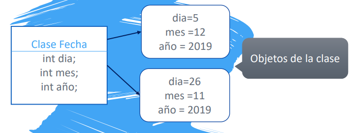
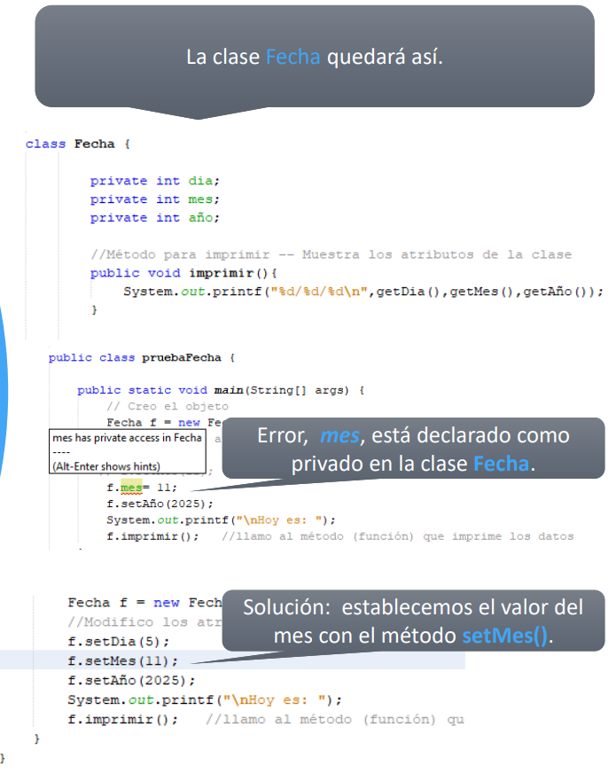
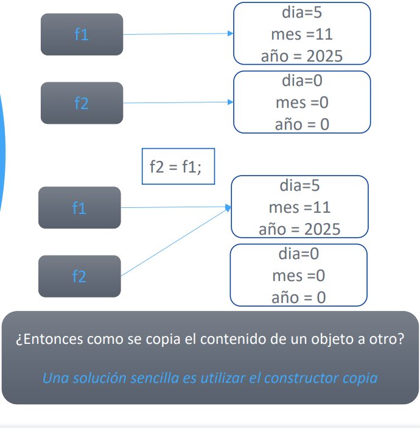
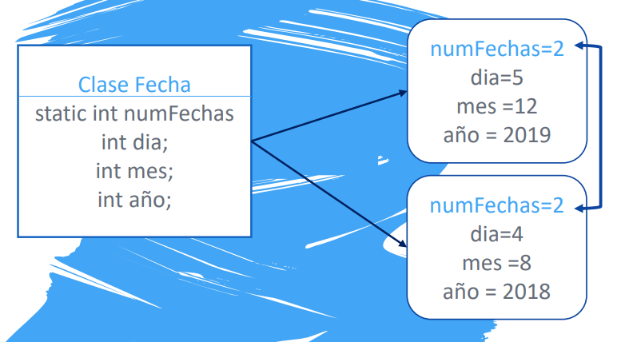

# UD6 - POO: Objetos y Clases

---

## 6.1. Clases y objetos

### 6.1.1 ¿Qué es una clase?

Una **clase** es una plantilla que define un tipo de dato mediante:

- **Atributos** — variables que representan el estado interno del objeto
- **Métodos** — funciones que acceden y/o modifican esos atributos

```java
class MiClase {
    // atributos
    int atributo1;
    String atributo2;

    // métodos
    void miMetodo() { ... }
}
```

Ejemplo: clase `Fecha` con tres atributos enteros:

```java
class Fecha {
    int dia;
    int mes;
    int año;
}
```

---

### 6.1.2 ¿Qué es un objeto?

Un **objeto** es una **instancia** de una clase: asigna valores concretos a los atributos definidos por la plantilla.
{ .center }
```
Clase Fecha          Objeto f1           Objeto f2
─────────────        ─────────────       ─────────────
int dia;      →      dia  = 5            dia  = 26
int mes;      →      mes  = 12           mes  = 11
int año;      →      año  = 2019         año  = 2019
```

```java
Fecha f = new Fecha();   // creación del objeto
// o en dos líneas:
Fecha f;
f = new Fecha();

// Acceso y modificación de atributos
f.dia = 5;
f.mes = 12;
f.año = 2019;

System.out.println(f.dia + "/" + f.mes + "/" + f.año);
```

---

## 6.2. Métodos de una clase

Los métodos se declaran **dentro del cuerpo de la clase**:

```java
public class Fecha {
    public int dia;
    public int mes;
    public int año;

    public void imprimir() {
        System.out.printf("%d/%d/%d", dia, mes, año);
    }
}
```

```java
Fecha f = new Fecha();
f.dia = 5; f.mes = 12; f.año = 2019;
f.imprimir();   // 5/12/2019
```

---

## 6.3. Getters y Setters

En general, no conviene que el usuario acceda directamente a los atributos de una clase. Para ello se crean:

- **Getters** — métodos de acceso que devuelven el valor de un atributo
- **Setters** — métodos de modificación que actualizan el valor de un atributo

```java
public class Fecha {
    public int dia;
    public int mes;
    public int año;

    // Getters
    public int getDia() { return dia; }
    public int getMes() { return mes; }
    public int getAño() { return año; }

    // Setters
    public void setDia(int nuevoDia) { dia = nuevoDia; }
    public void setMes(int nuevoMes) { mes = nuevoMes; }
    public void setAño(int nuevoAño) { año = nuevoAño; }
}
```

---

## 6.4. Modificadores de acceso

Los modificadores de acceso controlan desde dónde se puede acceder a un atributo o método:

| Modificador | Misma clase | Mismo paquete | Subclase | Cualquier clase |
|---|---|---|---|---|
| `public` | ✅ | ✅ | ✅ | ✅ |
| `protected` | ✅ | ✅ | ✅ | ❌ |
| `private` | ✅ | ❌ | ❌ | ❌ |

!!! warning "Buena práctica: atributos `private`"
    Los atributos deben declararse siempre como `private`. Así se impide el acceso directo desde fuera de la clase y se obliga a usar los getters y setters.

{ .center }

```java
public class Fecha {
    private int dia;   // ← privado
    private int mes;
    private int año;

    // acceso obligatorio a través de getters/setters
    public int getDia() { return dia; }
    public void setDia(int nuevoDia) { dia = nuevoDia; }
    public int getMes() { return mes; }
    public void setMes(int nuevoMes) { mes = nuevoMes; }
    // ...
}
```

```java
Fecha f = new Fecha();
f.mes = 11;        // ❌ ERROR: mes es private
f.setMes(11);      // ✅ correcto
```

---

## 6.5. Constructores

Un **constructor** es un método especial que se ejecuta al crear un objeto con `new`. Sirve para **inicializar los atributos**.

Características:
- Se llama **igual que la clase**
- **No tiene tipo de retorno** (ni siquiera `void`)

```java
public class Fecha {
    private int dia;
    private int mes;
    private int año;

    // Constructor
    public Fecha(int nuevoDia, int nuevoMes, int nuevoAño) {
        dia = nuevoDia;
        mes = nuevoMes;
        año = nuevoAño;
    }
}
```

```java
Fecha f = new Fecha(5, 12, 2019);  // se inicializa al crear
```

!!! info "Constructor por defecto"
    Si no defines ningún constructor, Java añade automáticamente uno **sin parámetros** que inicializa los atributos a sus valores por defecto (`0`, `null`, `false`...).  
    En cuanto defines **cualquier** constructor, el constructor por defecto **desaparece**. Si sigues necesitando `new Fecha()` sin parámetros, debes declararlo explícitamente.

---

## 6.6. La palabra clave `this`

`this` hace referencia al **objeto actual**. Su uso más habitual es en constructores, para distinguir entre los atributos de la clase y los parámetros cuando tienen el mismo nombre:

```java
public class Vehiculo {
    private int pasajeros;
    private int combustible;
    private int km;

    public Vehiculo(int pasajeros, int combustible, int km) {
        this.pasajeros   = pasajeros;    // this.x → atributo; x → parámetro
        this.combustible = combustible;
        this.km          = km;
    }
}
```

---

## 6.7. Igualdad de objetos y constructor copia

### 6.7.1 El problema con `==`

Las variables de tipo objeto almacenan **referencias** (direcciones de memoria), no los valores directamente. Cuando haces `f2 = f1`, ambas variables apuntan al **mismo objeto**:

{ .center }

```java
Fecha f1 = new Fecha(5, 11, 2025);
Fecha f2 = new Fecha();
f2 = f1;               // f2 apunta al mismo objeto que f1

f2.setDia(6);
System.out.println(f1.getDia());  // 6 ← ¡f1 también ha cambiado!
```

!!! warning "Nunca uses `==` para comparar objetos"
    `f1 == f2` solo es `true` si ambas variables apuntan exactamente al mismo objeto en memoria, no si tienen los mismos valores.

### 6.7.2 Constructor copia

Para copiar el **contenido** de un objeto en otro, se usa un **constructor copia**: recibe un objeto de la misma clase y copia sus valores atributo a atributo.


```java
public class Fecha {
    private int dia, mes, año;

    // Constructor copia
    public Fecha(Fecha f) {
        this.dia = f.getDia();
        this.mes = f.getMes();
        this.año = f.getAño();
    }
}
```

```java
Fecha f1 = new Fecha(5, 11, 2025);
Fecha f2 = new Fecha(f1);   // copia el contenido, no la referencia

f2.setDia(6);
System.out.println(f1.getDia());  // 5 ← f1 no cambia
System.out.println(f2.getDia());  // 6
```

---

## 6.8. Atributos y métodos `static`

Un miembro `static` es **compartido por todos los objetos** de la clase. No pertenece a ninguna instancia concreta, sino a la clase en sí.

{ .center }

```java
public class Empleado {
    private String nombre;
    private static int contadorEmpleados = 0;  // compartido por todos

    public Empleado(String nombre) {
        this.nombre = nombre;
        contadorEmpleados++;
    }

    public static int getNumeroEmpleados() {
        return contadorEmpleados;
    }
}
```

```java
Empleado e1 = new Empleado("Ana");
Empleado e2 = new Empleado("Luis");

System.out.println(Empleado.getNumeroEmpleados());  // 2
```

!!! info "Acceso a miembros `static`"
    Los miembros estáticos se acceden a través del **nombre de la clase**, no de un objeto: `Empleado.getNumeroEmpleados()`.

---

## 6.9. El método `toString()`

`toString()` es un método heredado de `Object` que devuelve una representación en texto del objeto. Si no lo sobreescribes, muestra algo como `Persona@45bc32a2`.

Sobreescribiéndolo con `@Override` puedes personalizar cómo se muestra el objeto:

```java
public class Persona {
    private String nombre;
    private int edad;

    public Persona(String nombre, int edad) {
        this.nombre = nombre;
        this.edad   = edad;
    }

    @Override
    public String toString() {
        return "Persona{nombre='" + nombre + "', edad=" + edad + "}";
    }
}
```

```java
Persona p = new Persona("Paco Guirau", 88);
System.out.println(p);   // Persona{nombre='Paco Guirau', edad=88}
```

!!! tip "¿Cuándo usar `toString()`?"
    Muy útil para depuración. Cuando haces `System.out.println(objeto)`, Java llama automáticamente a `toString()`.

---

## 6.10. Paquetes (`package`)

Un **paquete** es una agrupación de clases con temática o funcionalidad similar. Sirven para organizar el código y evitar conflictos de nombres.

Una clase puede acceder a todas las clases públicas de su mismo paquete sin necesidad de indicar el nombre del paquete. Para acceder a clases de otro paquete hay dos opciones:

```java
// Opción 1: indicar el nombre completo del paquete
java.util.Random rand = new java.util.Random();

// Opción 2: usar import (más habitual)
import java.util.Random;
Random rand = new Random();
```

---

## Resumen de la unidad

| Concepto | Clave |
|---|---|
| Clase | Plantilla con atributos y métodos |
| Objeto | Instancia concreta de una clase |
| Atributo | Variable que define el estado del objeto |
| Método | Función dentro de una clase |
| `private` | Atributo/método solo accesible desde la propia clase |
| `public` | Accesible desde cualquier clase |
| Getter | Método que devuelve el valor de un atributo |
| Setter | Método que modifica el valor de un atributo |
| Constructor | Método de inicialización; mismo nombre que la clase, sin `return` |
| `this` | Referencia al objeto actual |
| Constructor copia | Copia los valores de otro objeto del mismo tipo |
| `static` | Miembro compartido por todos los objetos de la clase |
| `toString()` | Representación en texto del objeto |
| `package` | Agrupación de clases relacionadas |
