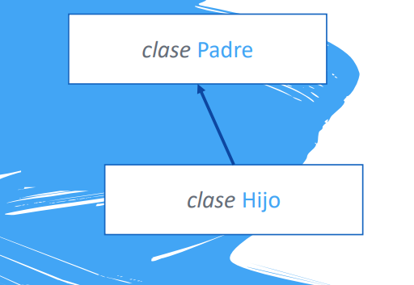
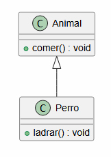
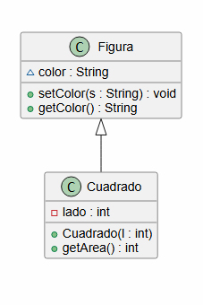

# UD7 - Herencia, Polimorfismo e Interfaces

---

## 7.1. Herencia

La **herencia** permite crear una nueva clase que recoge todas las características de otra, añadiendo sus propias particularidades. Modela la relación **ES-UN**: un `Perro` ES UN `Animal`, un `Coche` ES UN `Vehículo`.

{ .center }

Ventajas principales:

- **Reutilización de código** — la clase hija hereda todos los atributos y métodos de la clase padre
- **Extensibilidad** — la clase hija puede añadir nuevos atributos y métodos, o redefinir los heredados

!!! warning "No existe herencia múltiple en Java"
    Una clase solo puede heredar de **una única clase**. La herencia múltiple se simula mediante **interfaces** (ver sección 7.5).

### 7.1.1 Sintaxis: `extends`

```java
public class Animal {
    public void comer() {
        System.out.println("El animal está comiendo");
    }
}

public class Perro extends Animal {   // Perro hereda de Animal
    public void ladrar() {
        System.out.println("El perro está ladrando");
    }
}
```

{ .center }

```java
Perro miPerro = new Perro();
miPerro.comer();    // ✅ método heredado de Animal
miPerro.ladrar();   // ✅ método propio de Perro
```

!!! info "La relación es unidireccional"
    La clase hija puede usar métodos del padre, **pero no al revés**.

---

### 7.1.2 La clase `Object`

Toda clase en Java hereda, en última instancia, de **`java.lang.Object`**. Si una clase no extiende ninguna otra, Java asume implícitamente `extends Object`.

```
Object
  └── Figura
        └── Cuadrado
```

```java
public class Figura {
    String color;
    public void setColor(String s) { color = s; }
    public String getColor() { return color; }
}

public class Cuadrado extends Figura {
    private int lado;
    public Cuadrado(int l) { this.lado = l; }
    public int getArea() { return lado * lado; }
}
```

{ .center }

`Cuadrado` hereda `color`, `setColor()` y `getColor()` de `Figura`, y añade su propio atributo `lado` y método `getArea()`.

!!! warning "Atributos `private` del padre"
    Los atributos declarados como `private` en la clase padre **no son accesibles directamente** desde la clase hija. Debes usar los getters/setters públicos o protegidos del padre.

---

### 7.1.3 Sobrescribir métodos: `@Override`

La clase hija puede **redefinir** un método heredado para cambiar su comportamiento:

```java
public class Store {
    public void welcome() {
        System.out.println("Bienvenid@ a Store!");
    }
}

public class LiquorStore extends Store {
    @Override
    public void welcome() {
        System.out.println("Si eres menor de 18, vuelve a casa!");
    }
}
```

`@Override` es una anotación que indica al compilador que estamos redefiniendo un método del padre. No es obligatoria, pero es buena práctica: si el método no existe en el padre, el compilador avisa del error.

---

### 7.1.4 La palabra clave `super`

`super` hace referencia a la **clase padre**. Se usa para:

**Llamar a un método del padre** desde la clase hija:

```java
public class LiquorStore extends Store {
    @Override
    public void welcome() {
        super.welcome();   // ejecuta el welcome() del padre primero
        System.out.println("Si eres menor de 18, vuelve a casa!");
    }
}
```

**Llamar al constructor del padre** desde el constructor de la hija:

```java
public class Coche extends Vehiculo {
    private int numPuertas;

    public Coche(int pasajeros, int combustible, int km, int numPuertas) {
        super(pasajeros, combustible, km);  // llama al constructor de Vehiculo
        this.numPuertas = numPuertas;
    }
}
```

!!! info "Constructores y herencia"
    Si el constructor de la clase hija no llama explícitamente a `super(...)`, Java intenta llamar automáticamente al constructor **sin parámetros** del padre. Si ese constructor no existe, se produce un **error de compilación**.

    ```java
    class Animal {
        public Animal(String nombre) { ... }  // solo hay constructor con parámetros
    }
    class Perro extends Animal {
        public Perro(String nombre) {
            // ❌ ERROR: Animal no tiene constructor sin parámetros
            // ✅ Solución: añadir super(nombre); como primera línea
        }
    }
    ```

---

### 7.1.5 Sobrescribir métodos de `Object`

Como todas las clases heredan de `Object`, se pueden sobrescribir sus métodos. Los más habituales son `toString()` y `equals()`:

```java
public class Persona {
    private String nombre;
    private int edad;

    public Persona(String nombre, int edad) {
        this.nombre = nombre;
        this.edad   = edad;
    }

    @Override
    public String toString() {
        return nombre + " (" + edad + " años)";
    }

    @Override
    public boolean equals(Object obj) {
        Persona p = (Persona) obj;
        return this.nombre.equals(p.nombre) && this.edad == p.edad;
    }
}
```

```java
Persona p1 = new Persona("Paco", 44);
Persona p2 = new Persona("Rafa", 46);

System.out.println(p1);           // Paco (44 años)
System.out.println(p1.equals(p2)); // false
```

---

## 7.2. Encapsulación

La encapsulación consiste en **ocultar los detalles internos** de una clase y exponer solo lo necesario. Se consigue declarando los atributos como `private` y controlando su acceso mediante getters y setters públicos.

```java
// Sin encapsulación (peligroso)
persona.edad = -5;   // nadie lo impide

// Con encapsulación (seguro)
public void setEdad(int edad) {
    if (edad > 0 && edad < 150) {
        this.edad = edad;
    }
}
```

La encapsulación permite **validar** los datos antes de asignarlos, evitando estados inconsistentes en los objetos.

---

## 7.3. Clases abstractas

Una **clase abstracta** es una clase que no puede instanciarse directamente porque está pensada para ser genérica. Define una estructura común, pero deja algunos métodos **sin implementar** para que las subclases los completen.

```java
abstract public class Figura {
    protected Punto posicion;

    public Figura(Punto posicion) {
        this.posicion = posicion;
    }

    public Punto getFigura() {
        return posicion;
    }

    abstract public void dibujar();  // método abstracto: sin implementación
}
```

- Una clase con **al menos un método abstracto** debe declararse como `abstract`
- Las subclases **deben implementar** todos los métodos abstractos (o declararse también `abstract`)
- `new Figura()` → ❌ **ERROR**: las clases abstractas no se pueden instanciar

```java
public class Circulo extends Figura {
    private double radio;

    public Circulo(Punto posicion, double radio) {
        super(posicion);
        this.radio = radio;
    }

    @Override
    public void dibujar() {
        System.out.println("Dibujando círculo en " + posicion);
    }
}
```

---

## 7.4. Polimorfismo

El **polimorfismo** permite que una variable de un tipo padre pueda almacenar objetos de cualquier subclase:

```java
Vehiculo miCoche = new Coche(...);   // un Coche ES UN Vehiculo
```

### 7.4.1 Restricción de acceso

Cuando usas polimorfismo, **solo puedes acceder a los métodos del tipo declarado** (el padre), no a los específicos de la subclase:

```java
Vehiculo miCoche = new Coche(...);

miCoche.vehiculoDatos();       // ✅ método de Vehiculo
miCoche.getNumPuertas();       // ❌ ERROR: getNumPuertas() es de Coche
```

### 7.4.2 `instanceof` y typecast

Para acceder a los métodos propios de la subclase, primero comprueba el tipo con `instanceof` y luego haz un **cast**:

```java
Vehiculo[] vehiculos = new Vehiculo[10];
// ... rellenamos el array con distintos tipos de vehículos

for (int i = 0; i < vehiculos.length; i++) {
    if (vehiculos[i] instanceof Coche) {
        Coche c = (Coche) vehiculos[i];           // cast a Coche
        System.out.println(c.getNumPuertas());
    } else if (vehiculos[i] instanceof Van) {
        // ...
    }
}
```

!!! tip "¿Para qué sirve el polimorfismo?"
    Permite trabajar con colecciones heterogéneas de objetos relacionados (como el array de vehículos del ejemplo) usando una sola variable del tipo padre, sin saber de antemano de qué subclase concreta es cada objeto.

---

## 7.5. Interfaces

Una **interfaz** es un contrato que especifica qué métodos debe implementar una clase, sin proporcionar código. Se usa con la palabra clave `implements`.

```java
public interface Figura {
    public float calcularArea();
    public void dibujar();
}

public class Circulo implements Figura {
    // OBLIGATORIO implementar calcularArea() y dibujar()
    @Override
    public float calcularArea() { ... }

    @Override
    public void dibujar() { ... }
}
```

!!! info "Diferencias con la herencia"
    - Herencia (`extends`): una clase puede extender **solo una** clase padre
    - Interfaces (`implements`): una clase puede implementar **varias** interfaces → simula la herencia múltiple

---

### 7.5.1 Interfaz `Comparable`

Java incluye la interfaz `Comparable<T>` para comparar objetos. Obliga a implementar el método `compareTo()`:

| Valor devuelto | Significado |
|---|---|
| Negativo | El objeto actual va **antes** que el parámetro |
| Positivo | El objeto actual va **después** que el parámetro |
| `0` | Son **iguales** |

```java
class Persona implements Comparable<Persona> {
    private String nombre;
    private int edad;

    public Persona(String nombre, int edad) {
        this.nombre = nombre;
        this.edad   = edad;
    }

    @Override
    public int compareTo(Persona p) {
        if (this.edad > p.getEdad())      return -1;  // this va antes
        else if (p.getEdad() > this.edad) return  1;  // p va antes
        else                               return  0;  // iguales
    }
}
```

---

### 7.5.2 Interfaz `Comparator`

`Comparator<T>` permite definir un criterio de comparación **externo** a la clase, útil cuando necesitas varios criterios de ordenación distintos:

```java
public class PersonaComparator implements Comparator<Persona> {
    @Override
    public int compare(Persona p1, Persona p2) {
        return Integer.compare(p2.getEdad(), p1.getEdad()); // orden descendente por edad
    }
}
```

| Interfaz | ¿Dónde se define? | Método | Uso típico |
|---|---|---|---|
| `Comparable` | Dentro de la propia clase | `compareTo(T obj)` | Un único criterio natural de ordenación |
| `Comparator` | En una clase externa | `compare(T o1, T o2)` | Múltiples criterios de ordenación |

---

## Resumen de la unidad

| Concepto | Clave |
|---|---|
| `extends` | La clase hija hereda atributos y métodos del padre |
| `@Override` | Sobreescribe un método heredado |
| `super` | Accede a métodos/constructor del padre |
| Clase abstracta | No se puede instanciar; puede tener métodos sin implementar |
| `abstract` | Método sin cuerpo; las subclases deben implementarlo |
| Polimorfismo | Variable del padre puede contener objetos de subclases |
| `instanceof` | Comprueba el tipo concreto de un objeto |
| Typecast | Convierte un objeto al tipo concreto para acceder a sus métodos |
| `interface` | Contrato de métodos que una clase debe implementar |
| `implements` | Una clase implementa una interfaz |
| `Comparable` | Interfaz para definir el orden natural de una clase |
| `Comparator` | Interfaz para definir criterios de ordenación externos |
