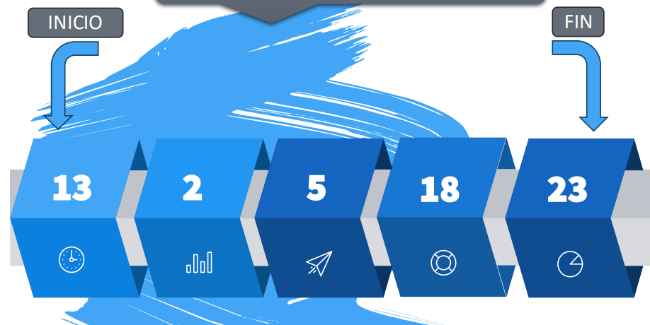
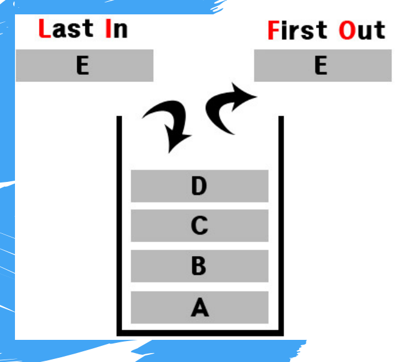
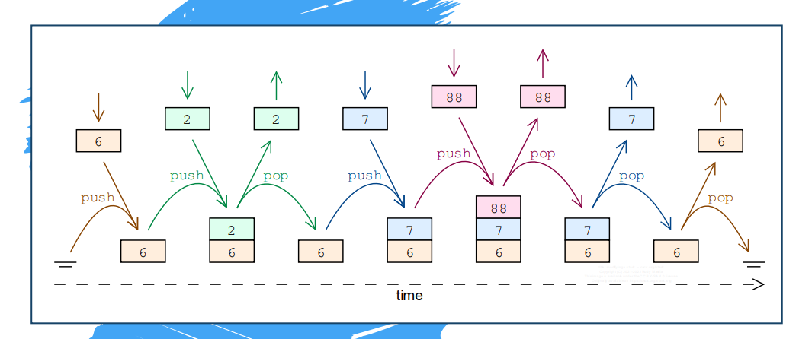
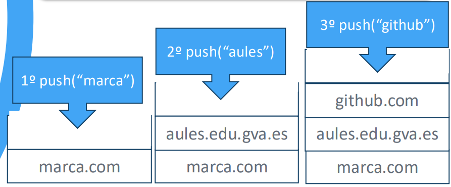
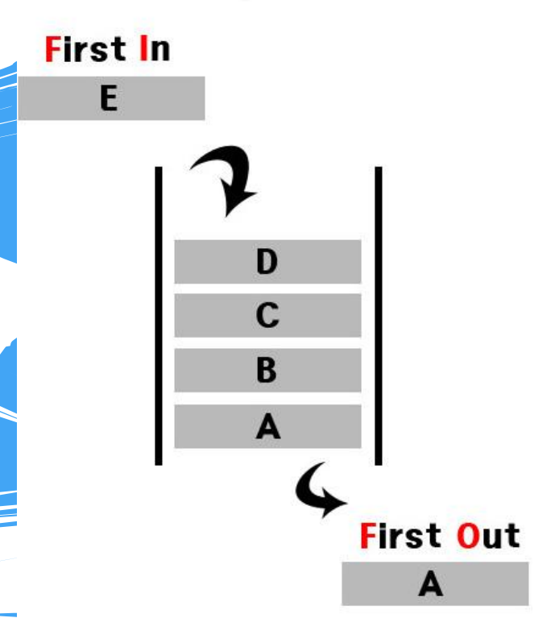
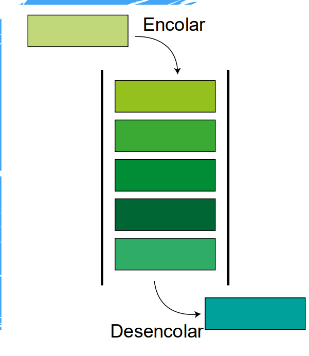
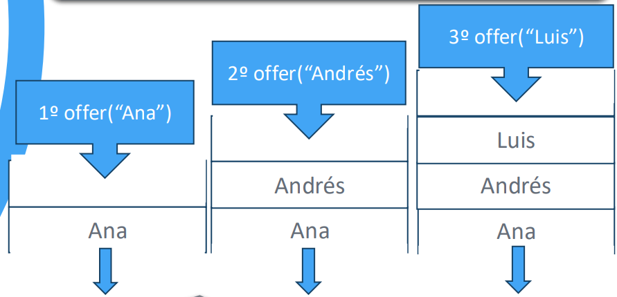

# UD8 - Estructuras de Datos Avanzadas

> Colecciones en Java: ArrayList, HashMap, LinkedList, Stack y Queue.

---

## 8.1. Colecciones en Java

Una **colección** es una estructura de datos que permite almacenar múltiples valores del mismo tipo, con la ventaja frente a los arrays de que su **tamaño es dinámico**: crece y decrece según necesidad.

Las colecciones más utilizadas en Java son:

| Colección | Tipo | Característica principal |
|---|---|---|
| `ArrayList` | Lista | Acceso por índice, tamaño dinámico |
| `LinkedList` | Lista enlazada | Inserción/eliminación eficiente en cualquier posición |
| `Stack` | Pila | LIFO — último en entrar, primero en salir |
| `ArrayBlockingQueue` / `LinkedList` | Cola | FIFO — primero en entrar, primero en salir |
| `HashSet` | Conjunto | Sin duplicados, sin orden |
| `HashMap` | Diccionario | Pares clave → valor |

!!! info "Tipos wrapper"
    Las colecciones en Java solo admiten **objetos**, no tipos primitivos. Usa los **wrappers**: `Integer` (por `int`), `Double` (por `double`), `Float`, `Long`, `Boolean`, `Character`.

---

## 8.2. ArrayList

Un `ArrayList` funciona como un array convencional pero con **tamaño dinámico**: puedes añadir y eliminar elementos sin declarar el tamaño de antemano.

### 8.2.1 Declaración e importación

```java
import java.util.ArrayList;

ArrayList<String> bdz = new ArrayList<String>();
ArrayList<Integer> nums = new ArrayList<Integer>();
```

### 8.2.2 Métodos principales

| Método | Descripción |
|---|---|
| `add(elemento)` | Añade un elemento al final |
| `add(índice, elemento)` | Inserta en la posición indicada, desplazando el resto |
| `get(índice)` | Devuelve el elemento en esa posición |
| `remove(índice)` | Elimina el elemento en esa posición |
| `remove(objeto)` | Elimina la primera aparición de ese valor |
| `size()` | Devuelve el número de elementos |
| `clear()` | Vacía la lista |

### 8.2.3 Ejemplo completo

```java
import java.util.ArrayList;

ArrayList<String> bdz = new ArrayList<String>();

// Añadir elementos
bdz.add("Goku");     // índice 0
bdz.add("Vegeta");   // índice 1
bdz.add("Freezer");  // índice 2

// Insertar en posición concreta
bdz.add(1, "Trunks");
// → Goku | Trunks | Vegeta | Freezer

// Recorrer con for clásico
for (int i = 0; i < bdz.size(); i++) {
    System.out.println(bdz.get(i));
}

// Recorrer con for-each (más recomendado)
for (String personaje : bdz) {
    System.out.println(personaje);
}

// Eliminar por posición
bdz.remove(2);           // elimina "Vegeta"

// Eliminar por valor
bdz.remove("Freezer");

// Vaciar la lista
bdz.clear();
System.out.println(bdz.size());  // 0
```

---

## 8.3. HashMap

Un `HashMap` es un **diccionario**: almacena datos en pares **clave → valor**. La clave permite acceder directamente al valor asociado.

!!! info "Características del HashMap"
    - **No puede haber claves duplicadas** (si insertas una clave que ya existe, el valor anterior se sobreescribe)
    - **No mantiene un orden** determinado
    - Sí pueden existir **valores duplicados**

### 8.3.1 Declaración e importación

```java
import java.util.HashMap;

HashMap<Integer, String> bdz = new HashMap<Integer, String>();
```

### 8.3.2 Métodos principales

| Método | Descripción |
|---|---|
| `put(clave, valor)` | Añade o actualiza un par clave → valor |
| `get(clave)` | Devuelve el valor asociado a la clave (o `null` si no existe) |
| `remove(clave)` | Elimina el par con esa clave |
| `containsKey(clave)` | Comprueba si existe esa clave |
| `size()` | Número de pares en el mapa |
| `entrySet()` | Devuelve todos los pares para iterar |

### 8.3.3 Ejemplo completo

```java
import java.util.HashMap;

HashMap<Integer, String> bdz = new HashMap<Integer, String>();

// Insertar pares (clave, valor)
bdz.put(123, "Goku");
bdz.put(912, "Freezer");
bdz.put(500, "Vegeta");

// Obtener por clave
System.out.println(bdz.get(912));  // Freezer
System.out.println(bdz.get(112));  // null → clave inexistente

// Mostrar todo el mapa
System.out.println(bdz);           // {912=Freezer, 500=Vegeta, 123=Goku}
// (el orden puede variar)

// Recorrer con entrySet
for (var entrada : bdz.entrySet()) {
    System.out.println(entrada.getKey() + " → " + entrada.getValue());
}
```

---

## 8.4. LinkedList (lista enlazada)

Una `LinkedList` es una lista donde cada elemento está **enlazado al siguiente**. Es ideal cuando el orden importa y se necesita insertar o eliminar elementos frecuentemente en cualquier posición.

{ .center }

```
INICIO → [13] → [2] → [5] → [18] → [23] → FIN
```

### 8.4.1 Declaración e importación

```java
import java.util.LinkedList;

LinkedList<String> alumnos = new LinkedList<String>();
```

### 8.4.2 Métodos principales

| Método | Descripción |
|---|---|
| `add(elemento)` | Inserta al final |
| `addFirst(elemento)` | Inserta al principio |
| `addLast(elemento)` | Inserta al final (equivale a `add`) |
| `get(pos)` | Devuelve el elemento en la posición `pos` |
| `getFirst()` | Devuelve el primer elemento |
| `getLast()` | Devuelve el último elemento |
| `removeFirst()` | Elimina y devuelve el primer elemento |
| `removeLast()` | Elimina y devuelve el último elemento |
| `size()` | Número de elementos |

### 8.4.3 Ejemplo completo

```java
import java.util.Collections;
import java.util.LinkedList;

LinkedList<String> alumnos = new LinkedList<String>();

alumnos.add("Carlos");
alumnos.add("Ana");
alumnos.addFirst("Bea");     // Bea queda al inicio
alumnos.addLast("David");

System.out.println(alumnos); // [Bea, Carlos, Ana, David]

System.out.println(alumnos.getFirst());  // Bea
System.out.println(alumnos.getLast());   // David

alumnos.removeFirst();       // elimina Bea
alumnos.removeLast();        // elimina David

System.out.println(alumnos); // [Carlos, Ana]

// Ordenar la lista
Collections.sort(alumnos);
System.out.println(alumnos); // [Ana, Carlos]
```

---

## 8.5. Stack (pila)

Una **pila** es una estructura de tipo **LIFO** (*Last In, First Out* — último en entrar, primero en salir). Los elementos se apilan por arriba y también se recuperan por arriba.

{ .center }

```
         ┌─────────┐
  push → │ github  │ ← pop / peek
         │ aules   │
         │ marca   │
         └─────────┘
```

Ejemplos reales: el botón **Atrás** del navegador, el comando **Deshacer** de un editor.

### 8.5.1 Declaración e importación

```java
import java.util.Stack;

Stack<String> historial = new Stack<String>();
```

### 8.5.2 Métodos principales

{ .center }

| Método | Descripción |
|---|---|
| `push(elemento)` | Apila (inserta) un elemento en la cima |
| `pop()` | Desapila (extrae y devuelve) el elemento de la cima |
| `peek()` | Devuelve el elemento de la cima sin extraerlo |
| `empty()` | `true` si la pila está vacía |

### 8.5.3 Ejemplo completo

{ .center }

```java
import java.util.Stack;

Stack<String> historial = new Stack<String>();

historial.push("marca.com");
historial.push("aules.edu.gva.es");
historial.push("github.com");

System.out.println(historial.peek());   // github.com (sin extraer)
System.out.println(historial.pop());    // github.com (extrae)
System.out.println(historial.pop());    // aules.edu.gva.es
System.out.println(historial.empty());  // false
System.out.println(historial.pop());    // marca.com
System.out.println(historial.empty());  // true
```

---

## 8.6. Queue (cola)

Una **cola** es una estructura de tipo **FIFO** (*First In, First Out* — primero en entrar, primero en salir). Los elementos se insertan por un extremo y se extraen por el otro.

{ .center }

```
offer →  [Luis] [Andrés] [Ana]  → poll
```

Ejemplos reales: cola de impresión, peticiones a un servidor.

### 8.6.1 Declaración e importación

En Java, `Queue` es una interfaz. La implementación más habitual es con `LinkedList`:

```java
import java.util.LinkedList;
import java.util.Queue;

Queue<String> cola = new LinkedList<String>();
```

{ .center }

### 8.6.2 Métodos principales

| Método | Descripción |
|---|---|
| `offer(elemento)` | Encola (inserta) un elemento al final |
| `poll()` | Desencola (extrae y devuelve) el primer elemento |
| `peek()` | Devuelve el primer elemento sin extraerlo |
| `isEmpty()` | `true` si la cola está vacía |

### 8.6.3 Ejemplo completo

{ .center }

```java
import java.util.LinkedList;
import java.util.Queue;

Queue<String> cola = new LinkedList<String>();

cola.offer("Ana");
cola.offer("Andrés");
cola.offer("Luis");

System.out.println(cola.peek());    // Ana (sin extraer)
System.out.println(cola.poll());    // Ana (extrae)
System.out.println(cola.poll());    // Andrés
System.out.println(cola.isEmpty()); // false
System.out.println(cola.poll());    // Luis
System.out.println(cola.isEmpty()); // true
```

---

## Resumen comparativo

| Colección | Estructura | Orden | Duplicados | Acceso |
|---|---|---|---|---|
| `ArrayList` | Lista | Por inserción | ✅ | Por índice |
| `LinkedList` | Lista enlazada | Por inserción | ✅ | Por índice / extremos |
| `Stack` | Pila LIFO | Por inserción | ✅ | Solo cima (`peek`/`pop`) |
| `Queue` | Cola FIFO | Por inserción | ✅ | Solo frente (`peek`/`poll`) |
| `HashMap` | Diccionario | Sin orden | ❌ en claves | Por clave |
| `HashSet` | Conjunto | Sin orden | ❌ | Iteración |

| Operación | `Stack` | `Queue` |
|---|---|---|
| Insertar | `push()` | `offer()` |
| Extraer | `pop()` | `poll()` |
| Consultar sin extraer | `peek()` | `peek()` |
| ¿Vacío? | `empty()` | `isEmpty()` |
